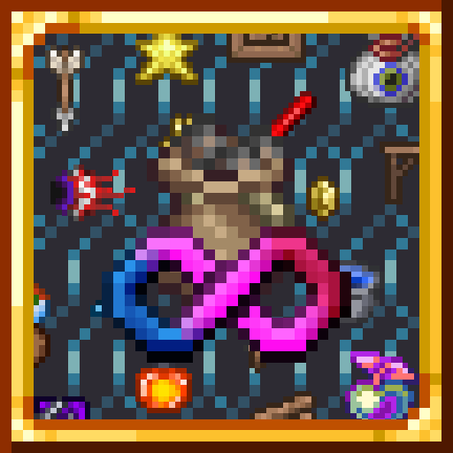

# Spy's Infinite Consumables

## Make every consumable item infinite

Collect enough a consumable item to make it infinite!
Depending of the item, this requirement may vary.
There are a wide variety of [Infinities](#infinities) for all sorts of consumables (usable, placeable, materials and more) each with their own sub-categories.

## Highly Customizable

Edit the [Infinity Settings](#infinity-settings) config to modify the behavior of the mod!
Toggle on/off certain Infinities, change the requirement of item or even set custom ones.

## No item duplication

***WORK IN PROGRESS, WILL CHANGE IN THE FUTURE***

Infinite NPCs will turn to smoke on pickup.
Placeable items will consume items above their infinity.

## Easel see the Infinities of an item

The Infinities of every item can be displayed in various ways:

- With colored tooltip lines. This can also be used to display extra information about the item such as its requirement or category.
- With a glow around the item. Note that it can sometimes be hard to see.
- With colored dot in the inventory slot.

Edit the [Infinities Display](#infinity-display) config to change which one is active, display additional information or change the color of the Infinities.

## Automatically detect the category of almost every item

If an item's category cannot be determined with the items's stats, it will be determined when the item is used!
This should work for almost every summoner, player booster and more.
If this fails, you can always set it via a custom requirement.

# Infinities

Infinities are grouped into Groups depending of the type of consumable they affect.
You can find below all vanilla Infinities their respective `Categories`.
Note than a consumable can be in includes in multiple Groups and Infinities.

## Item Infinities

### Usable

Items consumed upon use.

- `Weapon`: Deals damage.
- `Potion`: Heals life, mana or provides a buff (swiftness, archery...).
- `Booster`: Permanently change to the player (live, mana...) or the world

<!-- - `Recovery`: Heals life or mana.
 - `Buff`: Provides a buff (swiftness, archery...).
 - `Player Booster`: Give a permanent boost to the player (live, mana...).
 - `World Booster`: Permanently modifies the world. -->

- `Summoner`: Summons a boss or an event.
- `Critter`: Summons a critter or is a bait.

<!-- - `Explosive`: Destroys tiles -->

- `Tool`: Has a miscellaneous use (move the player, light an area, ...).
- `Tool?`: Is one of the above but not yet determined.

### Ammunition

Items used as ammunition and consumed by a weapon.

- `Basic`: Arrows, bullets, rockets and darts.

<!-- - `Explosive`: Explodes on impact. -->

- `Special`: All other ammunition.

### Placeable

Items placing a tile.

- `Tile`: Places a block or a wall.

<!-- - `Block`: Places a block.
 - `Wall`: Places a wall. -->

- `Torch`: Places a torch.
- `Ore`: Raw minerals.
- `Furniture`: Places a background tile

<!-- - `Light Source`: Emits light.
 - `Container`: Can store items.
 - `Functional`: Can be interacted with.
 - `Crafting Station`: Use to craf items.
 - `Decoration`: A basic furniture.
 - `Music Box`: Plays music. -->

- `Wiring`: Wires.
- `Mechanical`: Can be triggered with a wire.
- `Bucket`: Places or remove liquid.
- `Seed`: Grows into a plant.
- `Paint`: Color walls and tiles.

### Grab bag

Items giving various items when opened.

- `Container`: Can be opened.
- `Extractinator`: Can be extractinated
- `Treasure Bag`: Dropped form a boss in expert mode or above.

### Materials

Items used for crafting. Infinity is 1/2 of the requirement.

- `Basic`: Blocks, common items.
- `Ore`: Turn into bars.
- `Furniture`: All other placeables
- `Miscellaneous`: Only a material.
- `Non Stackable`: Weapons, armors, etc...

### Journey Sacrifices

Items that can be researched.

## Currency Infinities

### Currency

Currencies used to buy from NPCs.

- `Coins`: Currencies with more than one items (infinity is 1/50 of the requirement).
- `Single coin`: Currencies with a single item (infinity is 1/5 of the requirement).

# Configs

## Infinity Settings

This is the main config of the mod (server side).

- `Features` Controls specific aspects of the mod
- `Configs`: Controls key about each Infinity grouped by their Group. Each Group has an indecent subsonic controlling the behavior of its Infinities.
  - `Infinities`: Determines what group is enabled or used and their individual settings.
  - `Customs`: Custom requirement for any consumable.

## Infinity Display

Contains various ways to display the infinities of items and their  config.

- `General`: Determines what is displayed.
- `Displays`: Controls enabled infinity displays and their individual config.
- `Colors`: The displayed color of each Infinity
- `Performances`: Options to improve the performance of the mod
- `Version`: Contains information about the last update

# Changelog

### v3.1.1.2
- Fixed SikysLib reference to use the publish build and not the dev build

### v3.1.1.1
- Adjusted default colors
- Fixed loading error with MagicStorage

### v3.1.1
- Fixed Rubblemaker 
- Allowed requirements to copy each other
- Merged Enabled and Settings fields in configs
- Added Spiky's Lib mod dependency
- Simplified Infinity overrides
- Replaced RegisterTooltipLine and RegisterCountToStr with interfaces
- Removed "static" variants of classes
- Replaced AddConfig calls with a static field check
- Remade the update notification
- Fixed default values been saved in json

### v3.1.0.1
- Fixed dot display for recipe materials

### v3.1
- Automatic ModConfig port.
- Magic storage v0.6 support.
- Added group specific presets.
- Added a hard cap to the displays cache refresh rate.
- Added a Simple glow option.
- Added Cannon ammo detection
- Added display ModType.
- Reduced cache size and added 'spiccache' command to display it.
- Made CountToString and GetTooltipLine optional and modular
- Removed the need for Bucket detection
- Renamed 'Shop' to 'Currency' and added toggles for various shops.
- Renamed 'Liquid' to 'Bucket'
- Moved in-game changelog into the config and made welcome message less intrusive.
- Improved Extra localization
- Fixed configs not loading properly in Multiplayer

### v3.0
- 1.4.4 port.
- Added Extractinator GrabBag category.
- Corrected incorrect TooltipLine names and values.
- Added Ammo slots, Coin slots, Journey research and Recipe Material exclusive areas.
- Simplified Category detection for Explosives and Containers.
- Colors Infinities configs.
- Reworked configs UI to include a sub-config per Group.
- Change Glow infinity display to look like Treasure Bags glow.
- Merged Category detection and Customs.
- Localized all the mod.
- Added Exclusive display to only display Infinities in a specific context.
- Generalized Categories into Extras.
- Renamed Consumable Groups to Infinity.
- Added new ModType Groups to group Infinities by their consumable type.
- Reworked Presets and Infinities into ModType.
- Reworked cache.
- Fixed incorrect tooltip sprite for weapons.
- Fixed Hair style change always consuming coins.
- Fixed Customs causing lag.

### v2.2.1
- Added Welcome message.
- Added custom requirements.
- Added logs on group or preset register.
- Improved the ItemCountWrapper display.
- Added temporary Item duplication prevention for Placeables.
- Added UIElement for custom EntityDefinitions.
- Completed localization for groups.
- Fixed DisableAboveRequirement requirement display.
- Fixed items in Void Vault been ignored.
- Fixed infinity not updating when buying items.
- Fixed Disabled categories always been infinite.

### v2.2.0.1
- Renamed RequirementSettings to GroupSettings.
- Fixed a bug causing any non detectable category to never be used.
- Fixed a multiplayer crash caused by the config not properly loading.

### v2.2
- Added Journey Sacrifices group.
- Added Mixed group for enabled but unused groups.
- Disabled tile duplication as it is full of bugs.
- Reworked and abstracted Consumable Group API to be easier to use.
- Reworked category, infinity and requirement
- Lots of API changes and reworks
- Added new optional interfaces for groups.
- Created many ConfigElements.
- Overhauled the visual of the configs.
- Added new configs items and presets.
- Replaced customs with a blacklist
- Configs will now adapt to the registered groups.
- Renamed 'Consumables' to 'Usables' for clarity.
- Renamed and corrected typos.
- Performances improvement (I think ?).
- Fixed a lot of incorrect category detection
- Fixed many bugs

### v2.1
- Ported to next tml stable.
- Magic storage integration.
- Infinities are now displayed in item sprite, glow and tooltip.
- Added Infinity display config.
- Improved the way infinites are stored.
- Improved localization.
- Fixed colored tooltip not been correctly displayed.
- Fixed mouseItem not been counted or been counted twice.
- Fixed grab bags and opened by leftclick not been detected.
- Fixed potions used by right click not been detected.
- Fixed detected categories been applied one tick
- Fixed a bug in stack detection causing the mod to crash on load.
- Fixed other bugs.

### v2.0
- rewrote and cleaned the entire codebase.
- new category and infinity system.
- added currencies and grab bags categories.
- merged placeable and wand ammo.
- added information to the item tooltip.
- added sub categories for most categories.
- reworked infinite materials.
- can now detect usable and explosive items.
- Reworked tile duplication to use a chunk system and be included in .twld file.
- more flexible configs.
- added many new config items.
- removed commands.
- reworked stack detection mechanism to be automatic.
- performance improvement.
- updated desc and README
- en-US localization
- added mod icon
- fixed a ton of bug.

### v1.3.1
- Finally released on the Mod Browser.
- 'Liquid' buckets can now be infinite.
- Works with wires and actuators.

### v1.3
- Can now works with mods increasing max stacks and added related config items.
- Furniture will now have the right category.

### v1.2
- Prevents item duplication for infinite usables.
- Added new categories.

### v1.1
- Custom categories and values introduced.
- Added 'set', 'category' and 'values' commands.

### v1.0
- Consumables can now be infinite.
